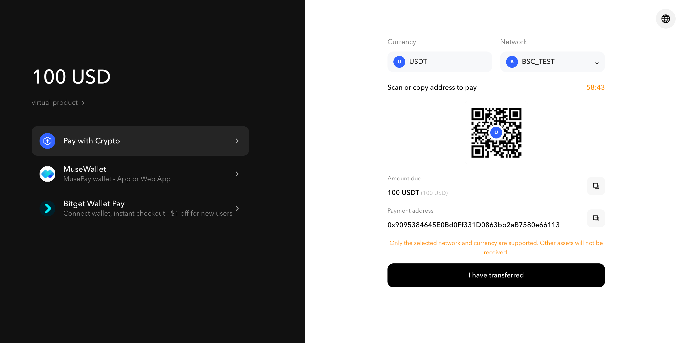

# 收银台支付方式

Checkout Mode 支持两种由 `payment_method` 控制的支付体验。您可以允许用户在收银台页面选择支持的 USDT 网络，也可以要求订单使用指定网络。

## 概览

| 收银台体验 | `payment_method` | `currency` 或 `pay_currency` | 用户体验 |
| --- | --- | --- | --- |
| 多链收银台 | `on_line` | `USDT` | 收银台页面允许用户选择任何受支持的 USDT 网络。 |
| 指定链收银台 | `on_chain` | 特定链资产，例如 `USDT_TRC20` | 收银台页面和返回的支付地址均固定为指定网络。 |

## 如何选择币种字段

应使用的字段取决于订单金额的计价方式：

* 对于以数字货币计价的订单，将 `currency` 设为 `USDT` 或特定链的 USDT 资产。
* 对于以法币计价的订单，将 `currency` 设为法币，并使用 `pay_currency` 控制用户的付款方式。

## 使用 `on_line` 的多链收银台

如果您希望用户在托管收银台页面上选择支付网络，请使用 `payment_method=on_line`。将相应的支付资产字段设为通用代码 `USDT`。

对于以数字货币计价的订单，相关字段如下：

```json
{
  "payment_method": "on_line",
  "currency": "USDT"
}
```

对于以法币计价的订单，在 `currency` 中保留法币，并将 `pay_currency` 设为 `USDT`：

```json
{
  "payment_method": "on_line",
  "currency": "IDR",
  "pay_currency": "USDT"
}
```

用户随后可以选择 MusePay 支持的任何 USDT 网络。

<figure><figcaption><code>on_line</code> 收银台允许用户在付款前选择支持的 USDT 网络。</figcaption></figure>


[多链收银台示例](../../reference/api-reference/acquiring-api/checkout-mode/multiple-chain-checkout.md)


## 使用 `on_chain` 的指定链收银台

当订单必须在指定网络上付款时，请使用 `payment_method=on_chain`。将相应的支付资产字段设为特定链代码，例如 `USDT_TRC20`。

对于以数字货币计价的订单，相关字段如下：

```json
{
  "payment_method": "on_chain",
  "currency": "USDT_TRC20"
}
```

对于以法币计价的订单，在 `currency` 中保留法币，并在 `pay_currency` 中指定网络：

```json
{
  "payment_method": "on_chain",
  "currency": "IDR",
  "pay_currency": "USDT_TRC20"
}
```

托管收银台页面和订单返回的地址将仅接受该网络上的 USDT。


[指定链收银台示例](../../reference/api-reference/acquiring-api/checkout-mode/specified-chain-checkout.md)



通用 `USDT` 代码仅可与 `on_line` 一起使用。使用 `on_chain` 时，请从[支持的资产](../supported-assets.md)中选择特定链的 USDT 代码。通过其他网络发送资金可能导致付款无法入账。


## 相关参考

* [创建收银台订单](../../reference/api-reference/acquiring-api/checkout-mode/README.md)
* [收银台付款金额处理](checkout-payment-amount-handling.md)
* [订单 Webhook](../../webhook/order.md)
