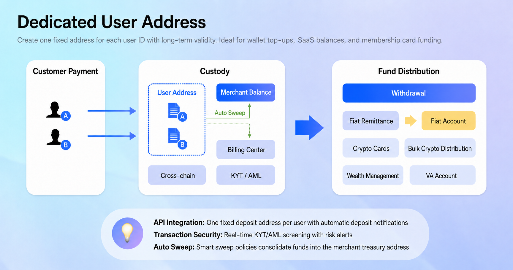
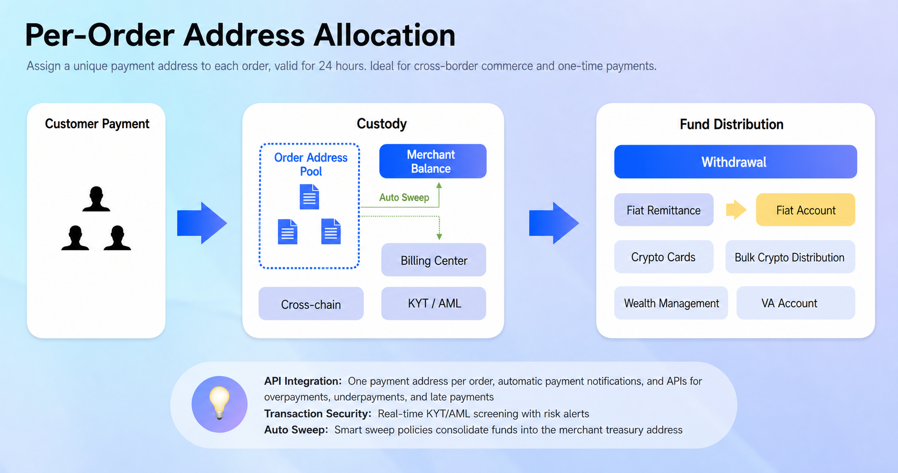

# Acquiring API

MusePay supports two crypto acquiring modes. Choose **Wallet Mode (Dedicated User Address)** when each user needs a reusable deposit address, or **Checkout Mode (Per-Order Address Allocation)** when your system creates a payment order before every payment.

Both modes notify your system after a deposit is detected. The main difference is when you create the local order and how long the receiving address remains associated with the payment context.

## Choose an integration mode

| | Wallet Mode (Dedicated User Address) | Checkout Mode (Per-Order Address Allocation) |
| --- | --- | --- |
| Address allocation | One fixed address for each user | One temporary address for each order |
| Address lifetime | Reusable for future deposits | Valid for one day by default |
| Local order timing | Create it after receiving the deposit notification | Create it before requesting a payment address |
| Amount handling | Credit the actual amount reported by MusePay | Reconcile the deposit against the amount in the order |
| Best suited for | Wallet top-ups, stored balances, recurring users | E-commerce checkout and one-time payments |

## Wallet Mode (Dedicated User Address)

Wallet Mode assigns a fixed deposit address to each user. The user can deposit to that address at any time. After MusePay detects and confirms the deposit, it sends your system an order webhook with the received amount. Your system then creates a local order and credits the user's balance.

<figure><figcaption>One reusable deposit address is associated with each user.</figcaption></figure>

### Integration flow

1. Complete [Authentication](../authentication.md) and implement [order webhooks](../../webhook/order.md).
2. Call the [Deposit Address](../../reference/api-reference/acquiring-api/wallet-mode.md#deposit-address) endpoint with the asset and your `customer_ref_id` to obtain the user's address.
3. Store the relationship between the user, asset, and returned address.
4. Allow the user to deposit to the address whenever needed.
5. When the webhook arrives, verify it and use the reported amount and `customerRefId` to create a local order and credit the correct user.
6. Use the [Query](../../reference/api-reference/acquiring-api/wallet-mode.md#query) endpoint when you need to retrieve the transaction details.


Treat webhook processing as idempotent. The same event must not credit a user's balance more than once.


## Checkout Mode (Per-Order Address Allocation)

Checkout Mode creates a new payment context for each order. Your system creates the order first, and MusePay returns a temporary receiving address that is valid for one day by default. MusePay sends an order webhook after the user deposits.

<figure><figcaption>Each order receives its own temporary payment address.</figcaption></figure>

### Integration flow

1. Complete [Authentication](../authentication.md) and implement [order webhooks](../../webhook/order.md).
2. Create the local order in your system with a unique request ID and the expected amount.
3. Call [Create Checkout Order](../../reference/api-reference/acquiring-api/checkout-mode/README.md#create-checkout-order) to obtain the order number, receiving address, and checkout URL.
4. Present the address or checkout URL to the user before it expires.
5. When the webhook arrives, verify it and reconcile the reported payment with your local order before fulfilling it.
6. Use [Query Order](../../reference/api-reference/acquiring-api/query-order.md) to retrieve the latest order status when needed.


[Checkout Payment Methods](checkout-payment-methods.md)



Payments can be underpaid, overpaid, or received after the address expires. Review [Checkout Payment Amount Handling](checkout-payment-amount-handling.md) before defining your fulfillment rules, and base fulfillment on the webhook or query result rather than the initial create-order response.



[Checkout Payment Amount Handling](checkout-payment-amount-handling.md)


## Related references

* [Supported Assets](../supported-assets.md)
* [Wallet Mode endpoints](../../reference/api-reference/acquiring-api/wallet-mode.md)
* [Checkout Mode endpoint](../../reference/api-reference/acquiring-api/checkout-mode/README.md)
* [Checkout Payment Methods](checkout-payment-methods.md)
* [Checkout Payment Amount Handling](checkout-payment-amount-handling.md)
* [Order webhook](../../webhook/order.md)
* [Order statuses](../../enums/order-status.md)
