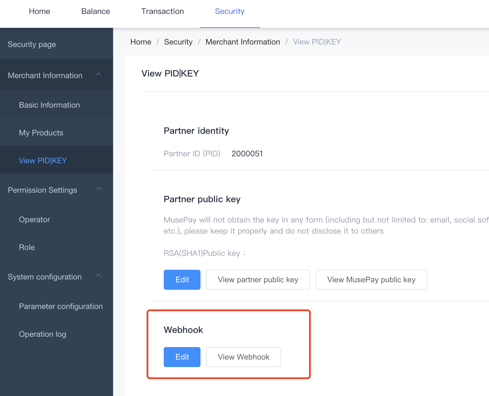

# WebHook

### Setting up

Setting a web-hook will allow you to get notifications for order status update. You can receive notifications on events in your orders such as incoming/outgoing transactions and transactions status update.  The Webhook url can be set up here:

Once your webHook url is setup, you will start receiving notification on events for your orders. All events will be sent with the following signature.&#x20;

* **sign** = Base64(_RSA_(PLATFORM\_PRIVATE\_KEY, SHA1(msgBody))

The public key for verifying the signature can be found here:

.png>)

### Data Objects

#### Notify Body

<table><thead><tr><th width="193.66666666666666">Parameter</th><th width="118">Type</th><th>Desc</th></tr></thead><tbody><tr><td>partner_id</td><td>String</td><td>The ID of your Account allocated from MusePay.</td></tr><tr><td>order_no</td><td>String</td><td>The ID of the transaction.</td></tr><tr><td>request_id</td><td>String</td><td>The external ID of the transaction provided by the partner.</td></tr><tr><td>order_type</td><td>String</td><td>The transaction type. see <a data-mention href="enums/order-type.md">order-type.md</a></td></tr><tr><td>product_code</td><td>String</td><td>The transaction sub-type.</td></tr><tr><td>currency</td><td>String</td><td>The name of crypto asset associated with the transaction.</td></tr><tr><td>order_amount</td><td>String</td><td>The requested amount.</td></tr><tr><td>fee_amount</td><td>String</td><td>The service fee amount.</td></tr><tr><td>actual_amount</td><td>String</td><td>The actual amount that was proceed to received.</td></tr><tr><td>finish_time</td><td>String</td><td>The completed time of the transaction.</td></tr><tr><td>status</td><td>Number</td><td>The status of Transaction, see <a data-mention href="enums/order-status.md">order-status.md</a></td></tr><tr><td>reason</td><td>String</td><td>The failed reason of transaction.</td></tr><tr><td>sign</td><td>String</td><td>Base64 encoded signature string.</td></tr><tr><td>extra_info</td><td>JSON String</td><td>Protocol / operation specific parameters.</td></tr></tbody></table>

#### Extra Info

<table><thead><tr><th width="200">Parameter</th><th width="120">Type</th><th>Desc</th></tr></thead><tbody><tr><td>description</td><td>String</td><td>extend info from the request.</td></tr><tr><td>txnHash</td><td>String</td><td>Blockchain hash of the transaction</td></tr><tr><td>customerRefId</td><td>String</td><td>The ID for the partner to associate the owner of funds(customer) with transactions</td></tr><tr><td>blockHeight</td><td>Number</td><td>The height (number) of the block the transaction was mined in</td></tr><tr><td>numOfConfirms</td><td>Number</td><td>The number of confirmations of the transaction. The number will increase until the transaction will be considered completed according to the confirmation policy.</td></tr><tr><td>networkFee</td><td>String</td><td>The fee paid to the network</td></tr><tr><td>sourceAddress</td><td>String</td><td>The source address of the transaction</td></tr><tr><td>destinationAddress</td><td>String</td><td>Address where the asset were transferred</td></tr><tr><td>destinationTag</td><td>String</td><td>Destination tag for XRP, used as memo for EOS/XLM</td></tr></tbody></table>

### Retry attempts

MusePay will send a POST request to the URL(s) associated with the partner and expect a 200 response. If no response is received, MusePay will resend the request several more times with an increasing delay between each attempt, the retry attemps will be taken after \[ 0,2,4,8,16,32,64] minutes. 
